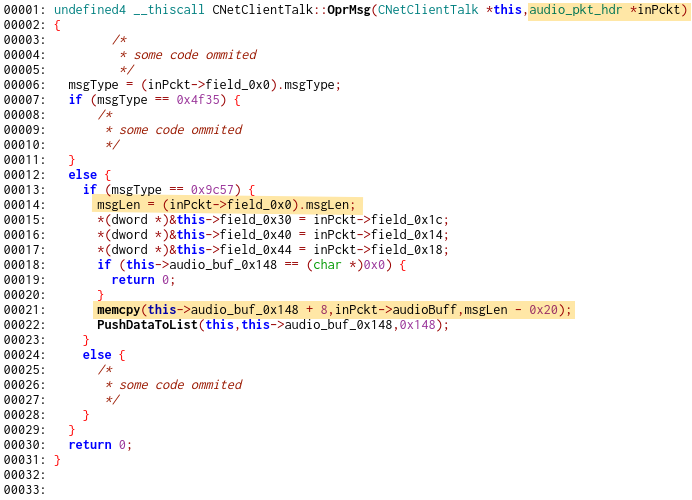

# How secure is your "security" camera?

##	Executive summary

In the beginning of 2020, at my former workplace, I had a chance to take
part in an internal pwn2own style event. There were several targets available,
but I was interested the most in [Accfly Wireless Security
camera](https://web.archive.org/web/20181022101437/https://www.amazon.co.uk/accfly-wireless-security-surveillance-detection/dp/b01l1gkpoc).
Unfortunately I had not been able to finish my research for the actual event, but
as there were no other attempts at this device, I kept it going.

The main focus of the research were vulnerabilities that could lead to remote
code execution (RCE). This type of vulnerability allows an attacker to take over full
control of the device and in case of video camera may result in a complete
compromise of the owner's privacy. Unfortunately the device firmware have been
found to be riddled with such issues.

First the device does not provide any authentication. As a result, an attacker
capable of connecting to it can freely access and reconfigure it. In the
simplest form it is possible to continuously restart the device, making it
completely unusable for the legitimate user. The scope of this attack is
slightly limited as the device is designed to be used within WiFi network,
usually behind NAT, thus not directly reachable from the Internet. However,
lack of an encryption between the device and its owner's smartphone app, along
with use of vendor's server as proxy for the communication, creates an
opportunity for a MitM or DNS manipulation attacks, which can break through the
WiFi NAT restriction.

Furthermore, the application uses proprietary binary protocol for
communication. It has been implemented in a mix of C and C++ and has been found
to be full of insecure string handling functions. The main executable contains
huge amount of unused code, which suggest that it is reused on other devices.
It makes maintenance harder and increases the attack surface. The application
does not enable any modern security mechanisms, which would protect it against
many common exploitation techniques. In addition, it does not even limit user
permissions, running as root - with the highest available privileges.

As a result of this research, following four vulnerabilities has been
documented. 

- **[CVE-2020-25782](#CVE-2020-25782)** - unauthenticated stack based buffer
 overflow in function `CNetClientManage::ServerIP_Proto_Set` on incoming
 message handling
- **[CVE-2020-25783](#CVE-2020-25783)** - unauthenticated heap based buffer
 overflow in function `CNetClientTalk::OprMsg` on incoming message handling
- **[CVE-2020-25784](#CVE-2020-25784)** - unauthenticated stack based buffer
 overflow in function `CNetClientGuard::SubOprMsg` on incoming message handling
- **[CVE-2020-25785](#CVE-2020-25785)** - unauthenticated stack based buffer
 overflow in function `CFtpProtocol::FtpLogin` during update procedure

For three of them a RCE exploits were developed, which allows an attacker to
gain complete control over the device. However, due to the lack of vendor
response to the vulnerability reporting attempts, this repository contains
only limited PoC exploits, that just crash the application.
 
The issues has been found in software version `V3.10.73` and verified in software
version `V4.15.77`, the latest one available at the time of this publication (26th of January 2021).

In case of any questions do not hesitate to contact me by email (see git commit)
or via Github issues. If you have an IoT device that you think might be
interesting to hack, are looking for a **Security Researcher** or just want to say
hi, I am happy to hear from you. You can also **[buy me a coffee!](https://buymeacoff.ee/bezet)**

## Introduction

The target device is a video camera device, which is controlled from the
accompanying mobile app. My analysis started with network traffic of the camera
and continued into the camera firmware. Custom binary protocol is used for all
communication. Commands are either send directly to the mobile device when in
the same network or pass through the device manufacturer server. The camera
software itself listens on multiple ports TCP (23456,34567) and UDP (34568,
34569). There is no encryption nor authentication for network traffic, which
allows for MitM attacks or direct access when the camera is exposed over the
network. It seems likely that access to the video stream is possible with no
authentication as well, but I have not reverse engineered enough of the
proprietary protocol to try this out.

<p align="center">

</p>

After brief communication overview, the next step was trying to get access to
the device firmware. My first attempt was to download it directly by hijacking
the device update process, but nothing like this happened in the network
traffic. I would have been stuck at this stage, if not for the very needed help
from a colleague who extracted the firmware from the flash memory, which
allowed me to continue with this research.

The firmware was found to be running Linux on MIPS little-endian CPU. There is exactly one
interesting process, called `Alloca`, which is responsible for video capture and
also handles all network communications. Application is created in C++ and
contains a lot of code, which is unused on this device. This indicates that the same software 
is used on different devices as well.

## The Leak

Even though this issue has been found last, it is crucial for actual
exploitation of most others, because they stem from use of unsafe C-language
string functions. While there exists several techniques that can be used for
successful code execution in similar scenarios, the application is created in
such way, that they are mostly useless. The main problem is that `Alloca`'s
code and data are statically allocated on low addresses (` <&nbsp;0x01000000`). Thus
attempts at reusing existing code (ie. ROP and similar) are not useful as they
require the ability to write addresses into the program's memory. Because
C-language strings use `\x00` as a termination character, and string functions
end processing at the first such byte, it is not possible to use more than a
single NULL-byte. In addition, stack location is randomized and application is
heavily multi-threaded which makes other techniques much less reliable.

This vulnerability is a result of sharing data between multiple threads and
insecure use of `strcpy`. While I have analysed this particular issue for a
long time, I have not spotted the chance to use it as a data leak vector until
only few weeks before this publication. Interestingly enough, thanks to leaking
heap address of C++ object, this vulnerability also allows for remote code
execution. However, this attack is not included in this report.

`Alloca` application can update itself over FTP. This operation can be
requested by a server, which also provides necessary username, password and
filename. The function which initiates update is shown here:


Three calls to `strcpy` are obviously insecure and lead to heap overflow, as the
`ftpUpgrade` object is dynamically allocated. Unfortunately the order in which
copies are performed and the `ftpUpgrade` structure layout make it impossible to actually
start a thread that will leak data. Taking a closer look, at the incoming packet
reveals the following structure: 

```C
struct ftp_upgrade_pkt {
	struct pktHeader;
	char username[16];
	char password[16];
	char filename[128];
}
```

while the `ftpUpgrade` object looks something like: 

```C
struct CNetClientFtpUpgrade {
	// ... something here
	char filename[128];
	char unknown[6];
	char username[16];
	char password[16];
	CFtpDownlad *;
	CNetClientConnect*;
	int something[5];
	bool threadRunning;
	// ... and more
}
```

The leak can happen after one of the inner pointers (`CFtpDownload*`,
`CNetClientConnect*`) is filled-in by the application. In addition, the
username and password are copied (once more, but securely this time) to the
newly created object before its pointer is stored in the leakable location,
thus the leak can only happen with `filename`. As a result, the filename has to
be very long, but due to the order and termination-behaviour of `strcpy` the
sufficiently long filename, will result in even longer username and password
which will in effect overwrite `threadRunning` and not start a thread at all.

If this code were single threaded, not much could be done. But as the new
**FtpDownload** thread is spawned and runs `DownloadFile` function, it presents
an interesting opportunity as it shares the `CNetClientFtpUpgrade` object with
the thread that handles the incoming packets. Not only it has multiple IO
operations that can be controlled externally (DNS requests, FTP connection
processing) but also tries connecting to the FTP up to 10 times (this is done in
the caller of `DownloadFile`). This allows to control execution of
**FtpDownload** thread (by blocking it on IO operations), thus giving time for
message handling thread to process other requests.


In short just by sending multiple update requests, it is possible to change the
`filename` (and other parameters) used by already running **FtpDownload** thread
and receive leaked heap address. As a bonus, the `FtpSize` function (marked in
green), uses the buffer inside the object referenced by the leaked address, to store the
`filename` itself, which allows for trivial injection of first stage shellcode. The
only limitation here are length and lack of NULL-bytes, due to use of `strcpy`.
A sample [PoC](runLeak.py) is provided that just leaks a heap address from the device.

## CVE-2020-25782
**unauthenticated stack based BO in function `CNetClientManage::ServerIP_Proto_Set`**

Complete lack of authentication on incoming traffic handling steered me to look
for packet handlers. One of interesting functions is `ServerIP_Proto_Set`.
It seems to be used to create a static overwrite for the DNS resolution. I have
not found a way to redirect the traffic this way, but there is another buffer
overflow here (marked in orange).


The data, that is directly read from the packet, is used inside `sprintf`
function. In this case it is assumed that the data from packet will fit
into 16 bytes buffer, but use of plain `%s` format allows writing as many
bytes as one might wish, provided that they do not contain NULL.

This vulnerability is rather limited. Although it is possible to write a lot of
data onto the stack, so using a NOP-sledge could work, it is not possible to
write NULL-bytes. Even trying to write a single NULL-byte, will fail, as the
`sprintf` function format precedes it with a `\n`. Another obstacle, is a `CMutex`
object which is stored after the buffer. Any attempt to overflow must fill this
mutex with a correct value (or at least one which will satisfy `CGuard`
destructor - marked in red). This is problematic, as the destructor dereferences the passed
variable twice and then uses its value in `pthread_mutex_unlock` call. After
some testing I have found out that a buffer filled with NULLs is sufficient to
correctly return from `pthread_mutex_unlock`, but it still needed to be
dereferenced into a proper memory address.

[The leak](#the-leak) comes to the rescue. The attack is a bit complex, as we
need a heap address that does not contain any NULL-bytes. Fortunately the search
is made easier, as the device provides us with an ability to perform remote
unauthenticated restart. Each time providing a different heap address space
allocation. So it is possible to just reset the device and leak an address
until an appropriate one is found. Conveniently this also allows to store a
short first stage of the shellcode. As we need to overcome a mutex issue (a
pointer to a pointer is needed), we leak another address, this time passing a
previously leaked address as the filename. Following diagram shows the expected
memory layout:


If everything goes as planned, it is possible to pass a 2nd address as the
mutex and the first one as return address. However, this is not necessary to just
crash an application as done by [PoC](runProtoSet.py).

## CVE-2020-25783
**unauthenticated heap based BO in function `CNetClientTalk::OprMsg`**

The device is supposed to allow for bi-directional voice communication. Another
handler for incoming packets, seems to be responsible for receiving and playing
audio. The `audio_pkt_hdr` network packet is described by the following structure:
```C
struct audio_pkt_hdr {
	struct pktHeader field_0x0;
	int field_0x14
	int field_0x18
	int field_0x1c
	char audioBuff[0x140];
}
```
One of the `pktHeader` structure fields is the length of the packet (as
transferred over the network). This field can be freely set by the sender. The
vulnerable part is copying data directly from incoming packet using untrusted
length value provided in the incoming packet header.



As can be seen, the `CNetClientTalk` object is created with following constructor:


so the above call to `memcpy` results in buffer overflow on the heap.
Unfortunately actual exploitation of this issue is rather hard. Even though it's
possible to repeatedly overwrite the heap, I have not found a way to control
what data will be stored on the heap after the overflowing buffer. As the
application has over 50 active threads, some of them responsible for
processing audio and video, it is constantly (de)allocating memory. This
results in heap data constantly changing thus making it hard to predict what's
stored after the buffer and correctly overwrite it.

## CVE-2020-25784
**unauthenticated stack based BO in function `CNetClientGuard::SubOprMsg`**

Here comes another handler of incoming packets. This time the network packet
has the following structure (the common packet header omitted): 

```C
struct pkt_hdr_sub_cliGuard {                            
  dword deviceId;                                 
  dword userId;                                  
  dword magic;                                  
  dword subCmd;                                  
  dword field_0x10;                                
  dword field_0x14;                                
  dword field_0x18;                                
  dword field_0x1c;                                
  dword guard_icommand;                              
  dword moreThenRandomStackValue;                         
  dword itemCnt;                                 
  char array_of_0x18[24];                             
};              
```

Again the interesting part is the last array (as we can grow this packet as much
as we want), which contains some internal structure of size 24. The
vulnerability stems from an assumption that the received `itemCnt` will not
exceed 6, because the copy destination buffer has the size 144 (=24*6), which
is visible on the following listing (orange highlight):


This time copy is performed using `memcpy` (green highlight), so there is no
limit on allowed characters. The copy is done in chunks, by a while loop (marked
in blue). It is worth noticing that the counter `cnt_v0` is decreasing inside a
loop, so chunks are copied in reverse order. Including the variables that
follow vulnerable buffer `buf`, the overflow need to have 256 bytes, then 4
registers (`$s0-$s3`) and `$ra`. Because we have no knowledge of memory layout,
the [PoC](runGuard.py) code uses a ROP technique. A single gadget is used,
which plays one of device's built-in sounds (and crashes).

## CVE-2020-25785
**unauthenticated stack based buffer overflow in function `CFtpProtocol::FtpLogin`**

One of initial directions of my analysis was to look for the update procedure.
As I found out, the device has an FTP update functionality, which can be
initiated by sending update request and results in downloading firmware from the
external FTP site. As with other vulnerabilities, there is no need to
authenticate before requesting the device update. In depth analysis of the ftp
functionality uncovered a stack based buffer overflow in the
`CFtpProtocol::FtpLogin` function. As we can see in the decompiled listing
below, the function passes a `char` array of size 256 into function `FtpPwd`.


`FtpPwd` is used to get current working directory from the FTP server. It loads
its internal buffer with up to 1500 bytes of response and then copies them to
the provided buffer. This sequence of calls results in 1242 bytes overflow. In
this case the allowed characters are very limited, as use of `"` (double-quote)
would result in shortening the input string (`strchr` is used to search for
`char` in a C-string) and would not overflow the buffer. Luckily it's only
necessary to deliver a single address, to which the code execution will be
redirected.


To exploit this vulnerability it is necessary to either control DNS or to
redirect (or MitM) connection to the FTP server. Application does not have any modern
protections in place, so it's possible to execute the code directly from the
stack. Without leak of an address, the best that could be done is either guessing the
stack location or redirection of an execution to a single function, which will then
crash the application. My first attempts was just that, playing one of a
built-in sounds, which is provided as [PoC](runFtp.py). Using 
[the leak](#the-leak), it is possible to get full control of the device.

## Timeline

- April 2020 - The vulnerabilities has been discovered
- June 2020 - First unsuccessful attempt at contacting the vendor (Accfly)
- July 2020 - Second unsuccessful attempt at contacting the vendor (Accfly)
- September 2020 - Request for a CVE assignment
- January 2021 - Full-disclosure of vulnerabilities

## Kudos

- [Michał 'Michoo' Madziar](https://www.doyensec.com) for his soldering wizardry and extracting the firmware
- [_0kami](https://twitter.com/__0kami) for very useful ghidra scripts and tips
- [tzdybal](https://github.com/tzdybal) for proofreading the draft of this document
